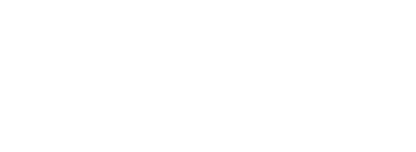
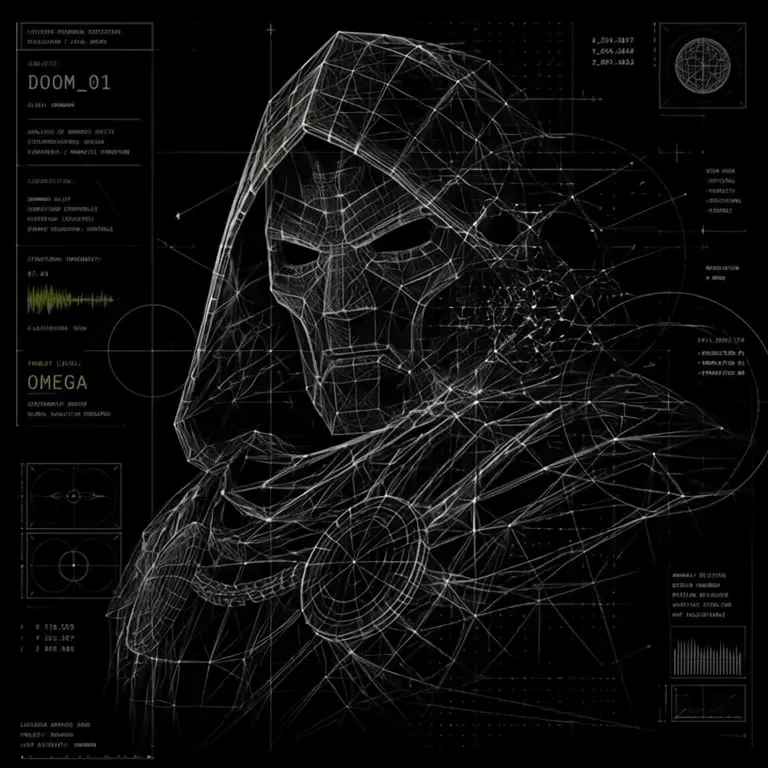

<!-- ====================================================== -->
<!-- HERO / BANNER -->
<!-- ====================================================== -->

  

<!-- ====================================================== -->
<!-- SOCIAL LINKS -->
<!-- ====================================================== -->

  &nbsp;

<!-- ====================================================== -->
<!-- ABOUT ME + DOCTOR DOOM -->
<!-- ====================================================== -->
<!-- ====================================================== -->
<!-- ABOUT ME + DOCTOR DOOM -->
<!-- ====================================================== -->
<table width="100%">
<tr>
<td width="60%" valign="top" align="left">

<h3>About Me</h3>

I am a Software Developer Intern and Systems Analysis student at FATEC, passionate about building reliable software and understanding how systems work as a whole.

My technical stack centers around TypeScript, React, Node.js, APIs, and relational databases. I work across both frontend and backend development, with a strong interest in backend architecture, system integration, scalability, and clean, maintainable code.

I am constantly looking to expand my technical knowledge by working on practical projects and exploring new technologies. My goal is to develop efficient solutions, improve my engineering skills, and build software that is both well-structured and purposeful.

</td>
<td width="40%" valign="middle" align="center">

</td>
</tr>
</table>
<!-- ====================================================== -->
<!-- STARK + LANGUAGES & TOOLS -->
<!-- ====================================================== -->
<table width="100%">
<tr>
<td width="510" align="center" valign="middle">

</td>
<td width="510" align="center" valign="top">
<h3 align="center">LANGUAGES &amp; TOOLS</h3>
 

</td>
</tr>
</table>

<!-- ====================================================== -->
<!-- GITHUB STATISTICS -->
<!-- ====================================================== -->
<!-- ====================================================== -->
<!-- SNAKE + STREAK STATS -->
<!-- ====================================================== -->
<table width="100%">
<tr>
<td width="510" align="center" valign="middle">

</td>
<td width="510" align="center" valign="middle">

</td>
</tr>
</table>
<!-- ====================================================== -->
<!-- STEVE JOBS QUOTE (BANNER) -->
<!-- ====================================================== -->

  

