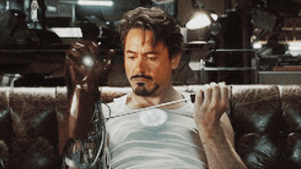
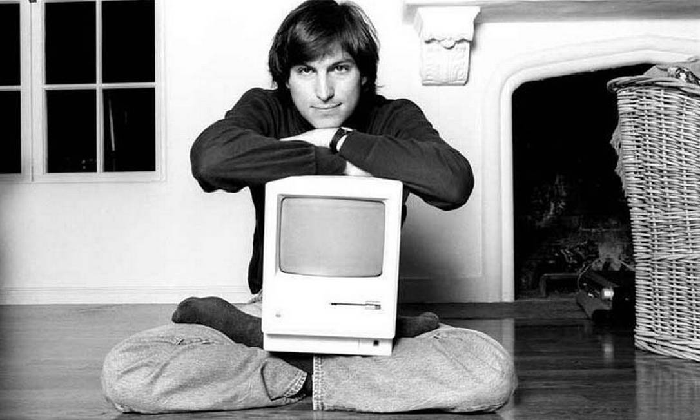

<!-- =========================================================================
  GITHUB PROFILE README - VINICIUS
  Estrutura / Casca baseada no modelo Figma com Caminhos dos Assets
========================================================================= -->

  <!-- =======================================================================
    1. HEADER BANNER (Banner.jpg)
  ======================================================================== -->
  <table width="100%" border="0" cellspacing="0" cellpadding="0">
    <tr>
      <td align="center" bgcolor="#0d1117" style="border-radius: 8px; overflow: hidden;">
        
      </td>
    </tr>
  </table>

   

  <!-- =======================================================================
    2. SEÇÃO: ABOUT ME + AVATAR DOCTOR DOOM (doom-hologram)
  ======================================================================== -->
  <table width="100%" border="0" cellspacing="0" cellpadding="0">
    <tr>
      <!-- ESQUERDA: ABOUT ME (65% WIDE) -->
      <td width="65%" valign="top" align="left" bgcolor="#0d1117" style="padding: 20px; border-radius: 8px;">
        <table width="100%" border="0" cellspacing="0" cellpadding="0">
          <tr>
            <td align="left"><h3 style="font-family: monospace; color: #ffffff; margin: 0;">About Me</h3></td>
            <td align="right"><code style="color: #8b949e;">[ STATUS: 200 OK ]</code></td>
          </tr>
        </table>
        

        

          I am a Software Developer Intern and Systems Analysis student at FATEC, focused on engineering scalable web architectures and managing server infrastructure.
        

        

          My technical stack centers around TypeScript, React, Node.js, and relational databases, where I prioritize efficient system integrations and clean code.
        

        

          Beyond software development, I actively work on hardware projects. My research and development involve IoT systems, 3D printing robotics, and reverse-engineering legacy ARM motherboards.
        

      </td>
      
      <!-- ESPAÇAMENTO ENTRE CARDS -->
      <td width="2%">&nbsp;</td>

      <!-- DIREITA: AVATAR DOCTOR DOOM (35% WIDE) -->
      <td width="33%" valign="middle" align="center" bgcolor="#0d1117" style="padding: 10px; border-radius: 8px;">
        <!-- NOTA: Se o GitHub não reproduzir o arquivo .webm via tag , converta para .gif ou .webp -->
        
      </td>
    </tr>
  </table>

   

  <!-- =======================================================================
    3. SEÇÃO: GIF (Stark.gif) + LANGUAGES & TOOLS
  ======================================================================== -->
  <table width="100%" border="0" cellspacing="0" cellpadding="0">
    <tr>
      <!-- ESQUERDA: GIF CONTAINER (Stark.gif) -->
      <td width="49%" valign="middle" align="center" bgcolor="#0d1117" style="padding: 10px; border-radius: 8px;">
        
      </td>

      <!-- ESPAÇAMENTO ENTRE CARDS -->
      <td width="2%">&nbsp;</td>

      <!-- DIREITA: LANGUAGES & TOOLS (50% WIDE) -->
      <td width="49%" valign="top" align="center" bgcolor="#0d1117" style="padding: 20px; border-radius: 8px;">
        <h3 style="font-family: monospace; color: #ffffff; margin-top: 0; margin-bottom: 15px;">LANGUAGES & TOOLS</h3>
        
        <!-- GRID DE ÍCONES (5 - 5 - 3) -->
        <!-- LINHA 1 (5 ÍCONES) -->
        

          &nbsp;
          &nbsp;
          &nbsp;
          &nbsp;
          
        

        <!-- LINHA 2 (5 ÍCONES) -->
        

          &nbsp;
          &nbsp;
          &nbsp;
          &nbsp;
          
        

        <!-- LINHA 3 (3 ÍCONES) -->
        

          &nbsp;
          &nbsp;
          
        

      </td>
    </tr>
  </table>

   

  <!-- =======================================================================
    4. SEÇÃO: STATS (2 ESTATÍSTICAS DO GITHUB LADO A LADO)
  ======================================================================== -->
  <table width="100%" border="0" cellspacing="0" cellpadding="0">
    <tr>
      <!-- STATS 1 (50% WIDE) -->
      <td width="49%" valign="top" align="center" bgcolor="#0d1117" style="padding: 15px; border-radius: 8px;">
        <!-- SUBSTITUA 'vinium12' CASO O NOME DE USUÁRIO SEJA OUTRO -->
        
      </td>

      <!-- ESPAÇAMENTO ENTRE CARDS -->
      <td width="2%">&nbsp;</td>

      <!-- STATS 2 (50% WIDE) -->
      <td width="49%" valign="top" align="center" bgcolor="#0d1117" style="padding: 15px; border-radius: 8px;">
        <!-- SUBSTITUA 'vinium12' CASO O NOME DE USUÁRIO SEJA OUTRO -->
        
      </td>
    </tr>
  </table>

   

  <!-- =======================================================================
    5. SEÇÃO: STEVE JOBS QUOTE & PHOTO (steve.jpg - UNIDOS SEM ESPAÇAMENTO)
  ======================================================================== -->
  <table width="100%" border="0" cellspacing="0" cellpadding="0" style="border-radius: 8px; overflow: hidden; background-color: #0d1117;">
    <tr>
      <!-- CITAÇÃO À ESQUERDA -->
      <td width="50%" valign="middle" align="center" style="padding: 30px 20px;">
        <blockquote style="border: none; margin: 0; padding: 0;">
          

            "We're here to put a dent in the universe. Otherwise, why else even be here?"
          

          <h4 style="font-family: monospace; color: #ffffff; font-weight: bold; margin: 0;">Steve Jobs</h4>
        </blockquote>
      </td>

      <!-- FOTO DO STEVE JOBS À DIREITA (steve.jpg) -->
      <td width="50%" valign="middle" align="right" style="padding: 0; margin: 0;">
        
      </td>
    </tr>
  </table>

